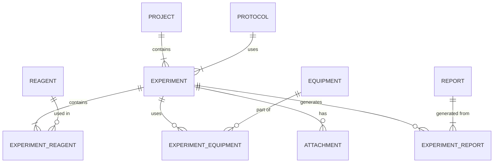

# Modelo de Datos (Esquema SQLite)
- Cada proyecto puede contener múltiples experimentos.
- Los experimentos pertenecen a un proyecto.
- Cada experimento se asocia a un protocolo que define el procedimiento.
- Cada experimento puede tener múltiples reactivos, equipos y adjuntos (archivos) asociados.
- Cada reactivo y equipo puede estar asociado a múltiples experimentos.
- Cada adjunto pertenece a un único experimento.
- Los informes se pueden generar a partir de varios experimentos o solo de uno.

## Diagrama Entidad-Relación (ER)

## Main Tables

### projects
| Field        | Type     | Nullable | Description                    |
|--------------|----------|----------|--------------------------------|
| id           | INTEGER  | No       | Primary key                    |
| name         | TEXT     | No       | Project name                   |
| description  | TEXT     | Yes      | Project description            |
| created_at   | DATETIME | No       | Creation date                  |
| modified_at  | DATETIME | No       | Last modification date         |

### protocols
| Field            | Type     | Nullable | Description                          |
|------------------|----------|----------|--------------------------------------|
| id               | INTEGER  | No       | Primary key                          |
| name             | TEXT     | No       | Protocol name                        |
| content_markdown | TEXT     | No       | Markdown content                    |
| created_at       | DATETIME | No       | Creation date                        |
| modified_at      | DATETIME | No       | Last modification date               |

### experiments
| Field          | Type     | Nullable | Description                                      |
|----------------|----------|----------|--------------------------------------------------|
| id             | INTEGER  | No       | Primary key                                      |
| project_id     | INTEGER  | No       | Foreign key to projects                          |
| protocol_id    | INTEGER  | No       | Foreign key to protocols                         |
| title          | TEXT     | No       | Experiment title                                 |
| state          | TEXT     | No       | Status: Running, Success, Fail                   |
| reaction_onset | TEXT     | Yes      | Description of the reaction onset                |
| workup         | TEXT     | Yes      | Description of the workup process                |
| purification   | TEXT     | Yes      | Description of the purification process          |
| notes          | TEXT     | Yes      | Additional notes                                 |
| created_at     | DATETIME | No       | Creation date                                    |
| modified_at    | DATETIME | No       | Last modification date                           |

### reagents
| Field                   | Type     | Nullable | Description                                  |
|-------------------------|----------|----------|----------------------------------------------|
| id                      | INTEGER  | No       | Primary key                                  |
| name                    | TEXT     | No       | Reagent name                                 |
| cas_number              | TEXT     | Yes      | CAS number                                   |
| smiles                  | TEXT     | Yes      | SMILES representation                        |
| in_stock                | BOOLEAN  | No       | Stock availability                           |
| lot_number              | TEXT     | Yes      | Lot number                                   |
| supplier                | TEXT     | Yes      | Supplier                                     |
| expiry_date             | DATE     | Yes      | Expiry date                                  |
| state                   | TEXT     | Yes      | Physical state (solid, liquid, gas)         |
| purity                  | REAL     | Yes      | Purity in %                                  |
| is_explosive            | BOOLEAN  | No       | GHS01                                        |
| is_flammable            | BOOLEAN  | No       | GHS02                                        |
| is_oxidizer             | BOOLEAN  | No       | GHS03                                        |
| is_gas_under_pressure   | BOOLEAN  | No       | GHS04                                        |
| is_corrosive            | BOOLEAN  | No       | GHS05                                        |
| is_acute_toxic          | BOOLEAN  | No       | GHS06                                        |
| is_harmful_irritant     | BOOLEAN  | No       | GHS07                                        |
| is_health_hazard        | BOOLEAN  | No       | GHS08                                        |
| is_environmental_hazard | BOOLEAN  | No       | GHS09                                        |
| created_at              | DATETIME | No       | Creation date                                |
| modified_at             | DATETIME | No       | Last modification date                       |

### equipment
| Field       | Type     | Nullable | Description             |
|-------------|----------|----------|-------------------------|
| id          | INTEGER  | No       | Primary key             |
| name        | TEXT     | No       | Equipment name          |
| description | TEXT     | Yes      | Equipment description   |
| created_at  | DATETIME | No       | Creation date           |
| modified_at | DATETIME | No       | Last modification date  |

### experiment_reagents
| Field         | Type    | Nullable | Description                         |
|---------------|---------|----------|-------------------------------------|
| experiment_id | INTEGER | No       | Foreign key to experiments         |
| reagent_id    | INTEGER | No       | Foreign key to reagents            |
| amount_used   | REAL    | Yes      | Amount used                        |
| unit          | TEXT    | Yes      | Unit of measure (mg, mL, etc.)     |

### experiment_equipment
| Field         | Type    | Nullable | Description                 |
|---------------|---------|----------|-----------------------------|
| experiment_id | INTEGER | No       | Foreign key to experiments |
| equipment_id  | INTEGER | No       | Foreign key to equipment   |

### reports
| Field         | Type    | Nullable | Description                         |
|---------------|---------|----------|-------------------------------------|
| id            | INTEGER | No       | Primary key                         |
| file_name     | TEXT    | No       | Original file name                  |
| stored_name   | TEXT    | No       | Name used for storage on disk       |
| extension     | TEXT    | No       | File extension                      |
| upload_date   | DATETIME | No       | Date and time of upload            |

### experiment_reports
| Field         | Type    | Nullable | Description                         |
|---------------|---------|----------|-------------------------------------|
| experiment_id | INTEGER | No       | Foreign key to experiments         |
| report_id     | INTEGER | No       | Foreign key to reports             |

### attachments
| Field         | Type    | Nullable | Description                                      |
|---------------|---------|----------|--------------------------------------------------|
| id            | INTEGER | No       | Primary key                                      |
| experiment_id | INTEGER | No       | Foreign key to experiments                      |
| file_name     | TEXT    | No       | Original file name                               |
| stored_name   | TEXT    | No       | Name used for storage on disk                   |
| extension     | TEXT    | No       | File extension                                    |
| upload_date   | DATETIME | No       | Date and time of upload            |

