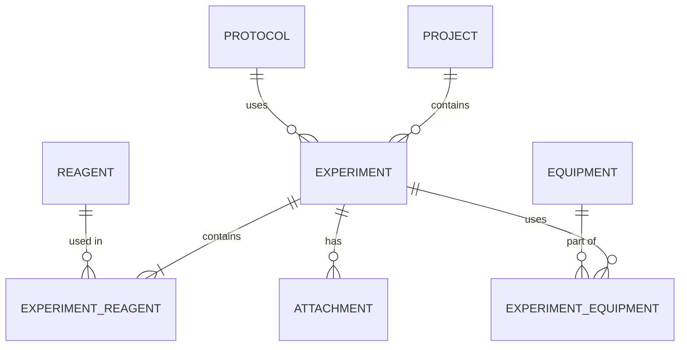

# **Documento de Planificación (PLAN): Khemeia ELN**

**Versión:** 2.0
**Stack Principal:** Python, NiceGUI, SQLite, RDKit, LM Studio.

---

## **1. Arquitectura del Sistema**

El sistema sigue un patrón de **Arquitectura en Capas** con separación explícita entre lógica de negocio y acceso a datos:

```
UI (NiceGUI)
    └── Services          ← Lógica de negocio
         └── Repositories ← Acceso a datos (SQL)
              └── SQLite
```

* **Capa de Interfaz (UI):** NiceGUI en modo escritorio (`native=True`). Gestiona formularios complejos, estado mutable y widgets condicionales (campos deshabilitados en experimentos bloqueados).
* **Capa de Servicios (Services):**
  * `ExperimentService`: Orquesta el ciclo de vida del experimento.
  * `InventoryService`: Gestión de reactivos y equipos.
  * `SecurityService`: Generación de hashes SHA-256 y bloqueo de registros.
  * `ExportService`: Generación de archivos `.eln` (RO-Crate) y PDF.
  * `AIService`: Gestión de prompts y conexión con el backend de IA activo.
  * `FileService`: Resolución de rutas de adjuntos y operaciones sobre el sistema de archivos.
* **Capa de Repositorios (Repositories):** Un repositorio por entidad de dominio. Los servicios nunca ejecutan SQL directamente.
* **Capa de Datos (Persistence):** SQLite para metadatos y relaciones. Sistema de archivos local para adjuntos, con rutas resueltas en tiempo de ejecución.

---

## **2. Modelo de Datos (Esquema SQLite)**

### **Diagrama Entidad-Relación (ER)**



### **Tablas Principales**

#### **projects**
| Field        | Type     | Description                    |
|--------------|----------|--------------------------------|
| id           | INTEGER  | Clave primaria                 |
| name         | TEXT     | Nombre del proyecto            |
| description  | TEXT     | Descripción del proyecto       |
| created_at   | DATETIME | Fecha de creación              |
| modified_at  | DATETIME | Fecha de modificación          |

#### **protocols**
| Field              | Type     | Description                          |
|--------------------|----------|--------------------------------------|
| id                 | INTEGER  | Clave primaria                       |
| name               | TEXT     | Nombre del protocolo                 |
| content_markdown   | TEXT     | Contenido en formato Markdown        |
| created_at         | DATETIME | Fecha de creación                    |
| modified_at        | DATETIME | Fecha de modificación                |

#### **experiments**
| Field           | Type     | Description                                            |
|-----------------|----------|--------------------------------------------------------|
| id              | INTEGER  | Clave primaria                                         |
| project_id      | INTEGER  | Clave foránea a projects                               |
| protocol_id     | INTEGER  | Clave foránea a protocols (nullable)                   |
| title           | TEXT     | Título del experimento                                 |
| state           | TEXT     | Estado: Running, Success, Fail                         |
| reaction_onset  | TEXT     | Descripción del inicio de la reacción                  |
| workup          | TEXT     | Descripción del trabajo posterior                      |
| purification    | TEXT     | Descripción del proceso de purificación                |
| notes           | TEXT     | Notas adicionales                                      |
| hash_sha256     | TEXT     | Hash SHA-256 (NULL hasta el cierre)                    |
| is_locked       | BOOLEAN  | Indica si el experimento está bloqueado para edición   |
| created_at      | DATETIME | Fecha de creación                                      |
| modified_at     | DATETIME | Fecha de modificación                                  |

> `created_by` y `modified_by` se eliminan como columnas. El autor se resuelve desde la configuración de la aplicación en tiempo de ejecución (ver sección 3.A).

#### **reagents**
| Field                   | Type     | Description                                  |
|-------------------------|----------|----------------------------------------------|
| id                      | INTEGER  | Clave primaria                               |
| name                    | TEXT     | Nombre del reactivo                          |
| cas_number              | TEXT     | Número CAS                                   |
| smiles                  | TEXT     | Representación SMILES                        |
| in_stock                | BOOLEAN  | Disponibilidad de stock                      |
| lot_number              | TEXT     | Número de lote                               |
| supplier                | TEXT     | Proveedor                                    |
| expiry_date             | DATE     | Fecha de caducidad                           |
| state                   | TEXT     | Estado físico (solid, liquid, gas)           |
| purity                  | REAL     | Pureza en %                                  |
| is_explosive            | BOOLEAN  | GHS01                                        |
| is_flammable            | BOOLEAN  | GHS02                                        |
| is_oxidizer             | BOOLEAN  | GHS03                                        |
| is_gas_under_pressure   | BOOLEAN  | GHS04                                        |
| is_corrosive            | BOOLEAN  | GHS05                                        |
| is_acute_toxic          | BOOLEAN  | GHS06                                        |
| is_harmful_irritant     | BOOLEAN  | GHS07                                        |
| is_health_hazard        | BOOLEAN  | GHS08                                        |
| is_environmental_hazard | BOOLEAN  | GHS09                                        |
| created_at              | DATETIME | Fecha de creación                            |
| modified_at             | DATETIME | Fecha de modificación                        |

#### **equipment**
| Field       | Type     | Description             |
|-------------|----------|-------------------------|
| id          | INTEGER  | Clave primaria          |
| name        | TEXT     | Nombre del equipo       |
| description | TEXT     | Descripción del equipo  |
| created_at  | DATETIME | Fecha de creación       |
| modified_at | DATETIME | Fecha de modificación   |

#### **experiment_reagents**
| Field         | Type    | Description                       |
|---------------|---------|-----------------------------------|
| experiment_id | INTEGER | Clave foránea a experiments       |
| reagent_id    | INTEGER | Clave foránea a reagents          |
| amount_used   | REAL    | Cantidad utilizada                |
| unit          | TEXT    | Unidad de medida (mg, mL, etc.)   |

#### **experiment_equipment**
| Field         | Type    | Description                   |
|---------------|---------|-------------------------------|
| experiment_id | INTEGER | Clave foránea a experiments   |
| equipment_id  | INTEGER | Clave foránea a equipment     |

#### **attachments**
| Field         | Type    | Description                                          |
|---------------|---------|------------------------------------------------------|
| id            | INTEGER | Clave primaria                                       |
| experiment_id | INTEGER | Clave foránea a experiments                          |
| file_name     | TEXT    | Nombre original del archivo                          |
| stored_name   | TEXT    | Nombre con el que se almacena en disco               |

> `file_path` se elimina. La ruta absoluta se resuelve en tiempo de ejecución mediante `FileService` combinando `BASE_DIR` (definido en configuración) + `attachments/{experiment_id}/{stored_name}`.

---

## **3. Estrategia Técnica y Componentes**

### **A. Configuración y Perfil de Usuario**

La aplicación es monousuario. No existe tabla `users`. El perfil se gestiona mediante un fichero `config.json` en el directorio raíz:

```json
{
  "user_name": "Ada Lovelace",
  "user_email": "ada@lab.edu",
  "base_dir": "/home/ada/khemeia",
  "ai_provider": "lmstudio"
}
```

Al arrancar la aplicación, si `config.json` no existe o está incompleto, se muestra un formulario de bienvenida bloqueante. En modo escritorio (`native=True`), el campo `base_dir` puede seleccionarse con el diálogo nativo de carpetas o escribirse manualmente. El nombre de usuario queda disponible globalmente para auditoría (`created_by`, `modified_by`) sin necesidad de pasarlo como parámetro en cada operación.

### **B. Patrón Repository**

Ningún servicio ejecuta SQL directamente. La cadena de dependencias es:

```
ExperimentService
    └── ExperimentRepository   → SELECT / INSERT / UPDATE sobre experiments
    └── ReagentRepository      → consultas sobre reagents y experiment_reagents
```

Esto permite testear `ExperimentService` con un repositorio en memoria sin tocar SQLite.

### **C. Integración de IA — Interfaz AIProvider**

Se define una interfaz `AIProvider` que desacopla el backend de IA del resto del código:

```
AIProvider (interfaz)
    ├── LMStudioProvider   → http://localhost:1234/v1
    ├── OllamaProvider     → http://localhost:11434/v1
    └── RemoteAPIProvider  → endpoint configurable
```

El proveedor activo se configura en `config.json`. `AIService` solo conoce la interfaz, no la implementación concreta. El sistema funciona al 100% como cuaderno si ningún proveedor está disponible.

### **D. Gestión de Adjuntos**

`FileService` es el único componente que conoce el sistema de archivos. Resuelve rutas a partir de `BASE_DIR`:

```
BASE_DIR/attachments/{experiment_id}/{stored_name}
```

La base de datos solo almacena `experiment_id` + `stored_name`. Si el usuario mueve la carpeta del proyecto, basta con actualizar `BASE_DIR` en `config.json`.

### **E. Seguridad e Integridad**

Cuando el usuario marca un experimento como **Success** o **Fail**:

1. `SecurityService` concatena todos los campos de texto del experimento + IDs de reactivos vinculados + `stored_name` de cada adjunto.
2. Genera `hashlib.sha256()` sobre esa cadena.
3. Persiste el hash en `hash_sha256` y activa `is_locked = True` vía `ExperimentRepository`.
4. La UI de NiceGUI deshabilita todos los controles de edición para ese experimento.

### **F. Visualización Química**

`ChemistryService` usa `rdkit.Chem.Draw` para convertir strings SMILES en imágenes SVG que se renderizan inline en la interfaz.

### **G. Interoperabilidad (RO-Crate)**

`ExportService` usa `rocrate-py` para empaquetar el JSON-LD de metadatos junto con los adjuntos del experimento en un archivo `.eln`.

---

## **4. Estructura de Carpetas**

```
khemeia_eln/
├── main.py                     # Entrada principal (NiceGUI native=True)
├── config.json                 # Perfil de usuario y BASE_DIR
├── docs/                       # Documentación
├── data/
│   ├── database.db             # SQLite
│   └── attachments/            # {experiment_id}/{stored_name}
├── src/
│   ├── database/
│   │   ├── connection.py       # Ciclo de vida de la conexión SQLite
│   │   └── schema.sql          # Migración inicial
│   ├── repositories/           # Un fichero por entidad
│   │   ├── experiment_repository.py
│   │   ├── reagent_repository.py
│   │   ├── equipment_repository.py
│   │   └── attachment_repository.py
│   ├── services/
│   │   ├── experiment_service.py
│   │   ├── inventory_service.py
│   │   ├── security_service.py
│   │   ├── export_service.py
│   │   ├── file_service.py
│   │   ├── chemistry_service.py
│   │   └── ai/
│   │       ├── ai_provider.py          # Interfaz AIProvider
│   │       ├── lmstudio_provider.py
│   │       ├── ollama_provider.py
│   │       └── remote_provider.py
│   └── ui/                     # Componentes y páginas NiceGUI
│       ├── pages/
│       │   ├── dashboard.py
│       │   ├── experiment_detail.py
│       │   ├── inventory.py
│       │   └── ai_assistant.py
│       └── components/         # Widgets reutilizables
├── tests/
│   ├── services/               # Tests unitarios con repositorios en memoria
│   └── repositories/           # Tests de integración contra SQLite en memoria
└── .env                        # Variables de entorno opcionales (override de config.json)
```

---

## **5. Estrategia de Testing**

Los tests se introducen desde la **Fase 1**, en paralelo al desarrollo de cada servicio.

| Tipo | Herramienta | Alcance |
|---|---|---|
| Unitario | `pytest` | Services con repositorios en memoria |
| Integración | `pytest` + SQLite `:memory:` | Repositories contra esquema real |
| Smoke | Manual | Flujo completo UI en cada fase |

Regla general: ningún servicio se considera completo sin su test unitario correspondiente.
